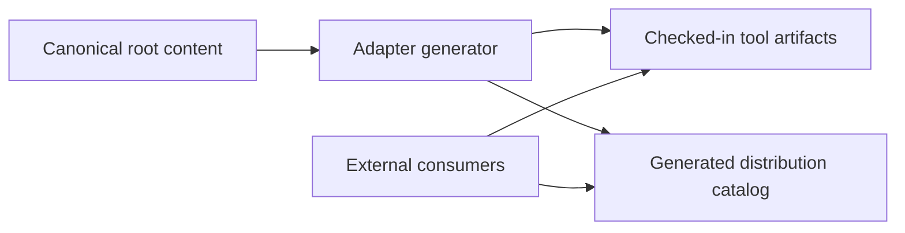

# 0008. Publish a Distribution Catalog Contract for External Consumers

Date: 2026-04-15

## Status

Proposed

## Context

The repo ownership model is now clear: root `agents/`, `skills/`, `rules/`, and
`workflows/` are canonical, while `claude-code/`, `github-copilot/`, and
`openai-codex/` contain tool-native adapters and runtime assets.

That model is easy to understand inside this repository, but external consumers still
face a brittle integration surface if they must infer concrete file locations from the
repo layout.

The current low-risk installation path remains checked-in tool artifacts. That matches
the repository direction in ADR-0005 and avoids a large backend-generation refactor.

However, the current adapter generation boundary is not yet fully canonical:

- important runtime metadata is still effectively derived from Claude adapter frontmatter
- cross-tool model mapping is currently encoded in `scripts/sync-canonical-adapters.js`
- external consumers can still drift if they rely on folder names, file naming, or
  undocumented layout assumptions

As this repo scales, path-based consumption creates unnecessary coupling between:

- internal repo structure
- generator implementation details
- installer UX in downstream systems

## Decision

### 1. The external contract will be a generated distribution catalog

This repository will publish a machine-readable distribution catalog as the stable
integration surface for external consumers.

The catalog will describe versioned, concrete, checked-in artifacts. External systems
should resolve assets through the catalog instead of reconstructing paths from repository
layout.

### 2. Checked-in tool artifacts remain the primary delivery surface

Tool-specific adapters and runtime assets will remain checked in under:

- `claude-code/`
- `github-copilot/`
- `openai-codex/`

This ADR does not move the repository to backend synthesis or on-demand asset
generation.

### 3. Canonical root metadata must own shared execution intent

Metadata that affects multiple tool surfaces must move into canonical root definitions
instead of being inferred from Claude-native wrappers.

This includes, at minimum:

- model tier or equivalent shared execution tier
- tool policy or capability declarations
- subagent declarations
- any other cross-tool behavioral metadata needed to render adapters or catalogs

Tool-native wrappers may still carry tool-specific formatting or runtime-only fields,
but they must not remain the hidden source of truth for shared behavior.

### 4. The catalog will be tool-aware and artifact-oriented

The catalog should provide enough information for external consumers to install or
download concrete assets without additional path logic.

Expected fields include:

- component id
- component kind
- component version
- target tool
- artifact path
- install path
- install command or install template
- bundle membership where applicable
- checksum or equivalent integrity field
- optional capability or metadata flags required by downstream installers

### 5. CI will validate generator parity and catalog integrity

The repository should fail validation when:

- canonical metadata and generated adapters disagree
- catalog entries reference missing artifacts
- catalog metadata drifts from generated install surfaces

## Diagram

## Consequences

### Positive

- external consumers stop depending on incidental repo layout
- checked-in artifacts remain the low-risk install path
- future backend generation remains possible behind the same contract
- catalog-driven install UX can be shared across downstream systems

### Neutral

- the repo will temporarily maintain both generated adapters and a generated catalog
- canonical metadata migration must happen before the catalog can be treated as fully
  authoritative

### Negative

- generator complexity increases in the short term
- CI coverage must expand to validate catalog and adapter parity
- some existing wrapper metadata must be migrated without breaking current tool surfaces

## Alternatives Considered

### 1. Keep external consumers path-coupled to the repository layout

Rejected. This is the lowest-effort short-term option, but it scales poorly and makes
every internal layout change a downstream integration risk.

### 2. Move directly to backend generation now

Rejected for now. This would require a broader refactor across definition resolution,
artifact assembly, install command generation, fixture metadata, and test coverage. The
checked-in artifact model is the safer stepping stone.

## References

- `docs/adr/0005-multi-tool-restructure.md`
- `scripts/sync-canonical-adapters.js`
- `scripts/generate-index.js`
