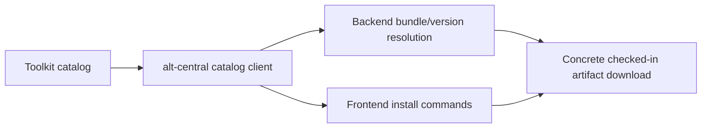

# ADR Draft: Consume the Agent Toolkit Through a Catalog Contract

Date: 2026-04-15

## Status

Proposed

## Context

`alt-central` currently downloads concrete files from the toolkit repository and embeds
tool-specific path and layout assumptions in application code.

The current hot spots are:

- `apps/backend/src/services/toolkit-version.ts`
- `apps/backend/src/services/bundles.ts`
- `apps/frontend/src/lib/installCommands.ts`

That approach works while the toolkit structure is stable, but it couples `alt-central`
to repository internals that are not meant to be a long-term external API.

The toolkit repository is moving toward a model where:

- root definitions are canonical
- tool directories contain generated or tool-native adapters
- concrete checked-in artifacts remain the low-risk install path
- a generated catalog can become the stable contract for downstream systems

`alt-central` should optimize for:

- robustness against toolkit layout changes
- low-friction install command generation
- incremental migration without blocking current downloads

## Decision

### 1. `alt-central` will resolve toolkit assets through a catalog client

`alt-central` will fetch a versioned toolkit catalog and resolve assets by:

- tool
- component or bundle
- version

Application code must stop reconstructing toolkit file paths directly.

### 2. `alt-central` will continue downloading concrete checked-in artifacts first

The first migration phase keeps the current delivery model: `alt-central` still downloads
real files or archives from the toolkit repository.

The change is in lookup strategy, not packaging strategy.

### 3. Install commands and bundle resolution will be catalog-driven

Install commands displayed in the frontend and bundle resolution performed in the backend
will be generated from catalog metadata rather than embedded per-tool rules.

### 4. A compatibility layer will exist during migration

If the requested toolkit version does not provide the catalog, `alt-central` may use a
temporary legacy resolver behind a feature flag or explicit compatibility path.

This fallback is transitional and should be removed after the supported toolkit versions
all publish the catalog.

### 5. Migration will happen one tool mode at a time

`alt-central` should migrate tool integrations incrementally rather than replacing all
tool logic in one refactor.

Recommended order:

1. backend catalog fetch and resolution layer
2. frontend install command generation from catalog data
3. bundle resolution from catalog data
4. removal of legacy path reconstruction

## Diagram

## Consequences

### Positive

- toolkit layout changes stop breaking `alt-central` by surprise
- install command generation becomes consistent across tools
- new tool modes or bundle shapes become easier to add
- future toolkit backend generation can be adopted later without another consumer rewrite

### Neutral

- `alt-central` will temporarily carry both catalog and legacy resolution paths
- migration sequencing needs explicit version support policy

### Negative

- initial refactor cost is non-trivial because path logic is currently spread across
  backend and frontend surfaces
- unsupported or partially migrated toolkit versions need clear user-facing errors

## Implementation Notes

The first migration should target these files:

- `apps/backend/src/services/toolkit-version.ts`
- `apps/backend/src/services/bundles.ts`
- `apps/frontend/src/lib/installCommands.ts`

The backend should own:

- catalog fetch
- version selection
- bundle-to-artifact resolution
- fallback behavior for legacy toolkit versions

The frontend should consume normalized install metadata instead of embedding tool-specific
command assembly rules.

## Alternatives Considered

### 1. Keep path-based resolution

Rejected. It is easy to maintain in the short term, but every toolkit restructure creates
new downstream risk.

### 2. Wait for full toolkit backend generation before changing `alt-central`

Rejected for now. That delays a needed decoupling step and keeps `alt-central` tied to
repo internals longer than necessary.
